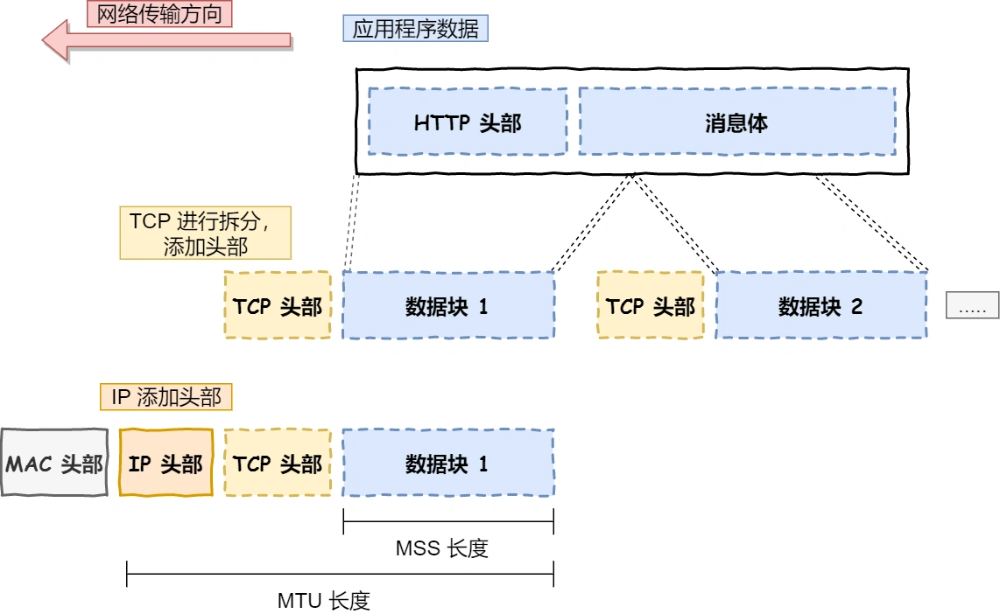
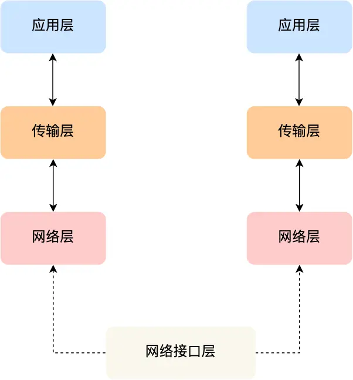

# 16 Nov - Thr

Today's stuff

<table data-header-hidden><thead><tr><th width="80" data-type="checkbox"></th><th width="120" data-type="select" data-multiple>Type</th><th>Action</th></tr></thead><tbody><tr><td>true</td><td></td><td>leetcode</td></tr><tr><td>false</td><td></td><td>6.824 zookeeper</td></tr><tr><td>true</td><td></td><td>0x3f tea</td></tr><tr><td>true</td><td></td><td>algorithm</td></tr><tr><td>false</td><td></td><td>日本語のstudy</td></tr><tr><td>false</td><td></td><td>xiaolin coding</td></tr></tbody></table>

## Notes & ideas


zookeeper


<details>

<summary>leetcode</summary>

1\. (打卡 1) [37 \[解数独\]](https://leetcode.cn/problems/sudoku-solver/description/) 🤩

.png>)

玩过但是用代码就。。。 整体思路就是递归+回溯吧\
然后用了点位运算x&-x优化

贴个题解 希望下次见能自己写出来）


```cpp
class Solution {
private:
    int line[9];
    int column[9];
    int block[3][3];
    bool valid;
    vector<pair<int, int>> spaces;

public:
    void flip(int i, int j, int digit) {
        line[i] ^= (1 << digit);
        column[j] ^= (1 << digit);
        block[i / 3][j / 3] ^= (1 << digit);
    }

    void dfs(vector<vector<char>>& board, int pos) {
        if (pos == spaces.size()) {
            valid = true;
            return;
        }

        auto [i, j] = spaces[pos];
        int mask = ~(line[i] | column[j] | block[i / 3][j / 3]) & 0x1ff;
        for (; mask && !valid; mask &= (mask - 1)) {
            int digitMask = mask & (-mask);
            int digit = __builtin_ctz(digitMask);
            flip(i, j, digit);
            board[i][j] = digit + '0' + 1;
            dfs(board, pos + 1);
            flip(i, j, digit);
        }
    }

    void solveSudoku(vector<vector<char>>& board) {
        memset(line, 0, sizeof(line));
        memset(column, 0, sizeof(column));
        memset(block, 0, sizeof(block));
        valid = false;

        for (int i = 0; i < 9; ++i) {
            for (int j = 0; j < 9; ++j) {
                if (board[i][j] != '.') {
                    int digit = board[i][j] - '0' - 1;
                    flip(i, j, digit);
                }
            }
        }

        while (true) {
            int modified = false;
            for (int i = 0; i < 9; ++i) {
                for (int j = 0; j < 9; ++j) {
                    if (board[i][j] == '.') {
                        int mask = ~(line[i] | column[j] | block[i / 3][j / 3]) & 0x1ff;
                        if (!(mask & (mask - 1))) {
                            int digit = __builtin_ctz(mask);
                            flip(i, j, digit);
                            board[i][j] = digit + '0' + 1;
                            modified = true;
                        }
                    }
                }
            }
            if (!modified) {
                break;
            }
        }

        for (int i = 0; i < 9; ++i) {
            for (int j = 0; j < 9; ++j) {
                if (board[i][j] == '.') {
                    spaces.emplace_back(i, j);
                }
            }
        }

        dfs(board, 0);
    }
};
```


\
2\. (打卡 2) [745 \[前缀和后缀搜索\] ](https://leetcode.cn/problems/prefix-and-suffix-search/description/)🤩

.png>)

难点就是trie树 然后用两颗树 一个存前缀一个存后缀



````cpp
```cpp
class WordFilter {
public:
    struct TrieNode{
        TrieNode* tns[26] {nullptr};
        vector<int> idxs;
    };
    void add(TrieNode* p,const string& s,int idx,bool isTurn){
        int n = s.size();
        p->idxs.push_back(idx);
        for(int i = isTurn ? n-1 :0;i>=0&&i<n;i+=isTurn?-1:1){
            int u=s[i]-'a';
            if(p->tns[u] == nullptr) p->tns[u]=new TrieNode();
            p = p->tns[u];
            p->idxs.push_back(idx);
        }
    }
    int query(const string& a,const string& b){
        int n = a.size(),m=b.size();
        auto p=tr1;
        for(int i=0;i<n;i++){
            int u=a[i]-'a';
            if(p->tns[u]==nullptr)return -1;
            p=p->tns[u];
        }
        vector<int>& l1 = p->idxs;
        p=tr2;
        for(int i = m - 1; i >= 0; i--) {
            int u = b[i] - 'a';
            if(p->tns[u] == nullptr) return -1;
            p = p->tns[u];
        }
        vector<int>& l2 = p->idxs;
        n = l1.size(), m = l2.size();
        for(int i = n - 1, j = m - 1; i >= 0 && j >= 0; ) {
            if(l1[i] > l2[j]) i--;
            else if(l1[i] < l2[j]) j--;
            else return l1[i];
        }
        return -1;
    }
    TrieNode* tr1 = new TrieNode, *tr2 = new TrieNode;
    WordFilter(vector<string>& ss) {
        int n = ss.size();
        for(int i = 0; i < n; i++) {
            add(tr1, ss[i], i, false);
            add(tr2, ss[i], i, true);
        }
    }
    
    int f(string a, string b) {
        return query(a, b);
    }
};

/**
 * Your WordFilter object will be instantiated and called as such:
 * WordFilter* obj = new WordFilter(words);
 * int param_1 = obj->f(pref,suff);
 */
```
````


\
3\. (每日) [2760 \[最长奇偶子数组\]](https://leetcode.cn/problems/longest-even-odd-subarray-with-threshold/description/?envType=daily-question\&envId=2023-11-16) 

.png>)

第一反应是暴力。。sry dp应该是最优解

$$Dp(i) = \begin{cases} 0, & nums[l]>threshold \\ dp[i+1]+1, & nums[l]<=threhold  && (nums[i]mod2!=nums[i+1]mod2） \\ 1,& otherwise \\ \end{cases}$$

latex好难写。。。


````cpp
```cpp
class Solution {
public:
    int longestAlternatingSubarray(vector<int>& nums, int threshold) {
        int ans=0,dp=0,n=nums.size();
        for(int l=n-1;l>=0;l--){
            if(nums[l] > threshold){
                dp = 0;
            }else if(l==n-1||nums[l]%2!=nums[l+1]%2){
                dp++;
            }else{
                dp=1;
            }
            if(nums[l]%2==0){
                ans=max(ans,dp);
            }
        }
        return ans;
    }
};
```
````


</details>

<details>

<summary><a href="https://codeforces.com/contest/721/problem/C">tea</a></summary>

```
https://codeforces.com/contest/721/problem/C

输入 n(2≤n≤5000) m(1≤m≤5000) maxT(1≤maxT≤1e9)。
然后输入 m 条边，每条边输入 v w t(1≤wt≤1e9)，表示有一条边权为 t 的有向边连接 v 和 w。节点编号从 1 开始。
保证输入的是一个有向无环图，并且没有重边。

求出从 1 到 n 的一条路径，要求路径长度（边权之和）不超过 maxT，在满足该条件的前提下，路径上的节点数最多。
输出两行，第一行是路径上的节点个数，第二行按顺序输出路径上的节点编号（第一个数必须是 1，最后一个数必须是 n）。
保证至少有一条满足要求的路径。
```

example:

.png>)

```markdown
提示 1：把「经过了多少个点」作为额外的 DP 维度，把「最短长度」作为 DP 值。

提示 2：定义 f[i][w] 表示从 1 到 w，经过了 i+1 个点的最短长度。i 最大为 n-1。
初始值：f[0][1] = 0，其余为无穷大。
状态转移方程：f[i][w] = min(f[i-1][v]+t)，其中有向边 v->w 的边权为 t。
答案：最大的满足 f[i][n] <= maxT 的 i，再加一（注意 i 是从 0 开始的）。

提示 3：从转移方程可以看出，其实不需要建图，只需要循环 n-1 次，每次遍历这 m 条边，在遍历时计算状态转移。
这是因为 f[i][] 只依赖于 f[i-1][]，在把 f[i-1][] 算出来后，无论按照什么顺序遍历这 m 条边都是可以的。

提示 4：计算状态转移的时候，额外记录转移来源 from[i][w] = v。
从 n 出发，顺着 from 数组回到 1，就得到了具体方案。
```

😢我恨dp&#x20;


```go
package main

import (
	"bufio"
	. "fmt"
	"io"
	"os"
)

func Cf721C(_r io.Reader, _w io.Writer) {
	in := bufio.NewReader(_r)
	out := bufio.NewWriter(_w)
	defer out.Flush()

	var n, m int
	var maxT int32
	Fscan(in, &n, &m, &maxT)
	es := make([][3]int32, m)
	for i := range es {
		Fscan(in, &es[i][0], &es[i][1], &es[i][2])
	}
	const mx = 5001
	f := make([][mx]int32, n)
	for i := range f {
		for j := 1; j <= n; j++ {
			f[i][j] = maxT + 1
		}
	}
	f[0][1] = 0
	from := make([][mx]int16, n+1)
	ans := 0
	for i := 1; i < n; i++ {
		for _, e := range es {
			v, w, t := e[0], e[1], e[2]
			sumT := f[i-1][v] + t
			if sumT < f[i][w] {
				f[i][w] = sumT
				from[i][w] = int16(v)
			}
		}
		if f[i][n] <= maxT {
			ans = i
		}
	}

	Fprintln(out, ans+1)
	path := make([]any, ans+1)
	v := int16(n)
	for i := ans; i >= 0; i-- {
		path[i] = v
		v = from[i][v]
	}
	Fprint(out, path...)
}
func main() { Cf721C(os.Stdin, os.Stdout) }
```


</details>

<details>

<summary><a href="https://pdos.csail.mit.edu/6.824/papers/zookeeper.pdf">6.824 zookeeper</a></summary>


</details>

<details>

<summary><a href="https://oi-wiki.org/string/trie/">algorithm</a></summary>

今日算法 trie树

也就是字典树 这棵字典树用边来代表字母，而从根结点到树上某一结点的路径就代表了一个字符串。举个例子，1->4->8->13表示的就是字符串 `caa`。

有时需要标记插入进 trie 的是哪些字符串，每次插入完成时在这个字符串所代表的节点处打上标记即可。



```cpp
//模板
struct trie {
  int nex[100000][26], cnt;
  bool exist[100000];  // 该结点结尾的字符串是否存在

  void insert(char *s, int l) {  // 插入字符串
    int p = 0;
    for (int i = 0; i < l; i++) {
      int c = s[i] - 'a';
      if (!nex[p][c]) nex[p][c] = ++cnt;  // 如果没有，就添加结点
      p = nex[p][c];
    }
    exist[p] = 1;
  }

  bool find(char *s, int l) {  // 查找字符串
    int p = 0;
    for (int i = 0; i < l; i++) {
      int c = s[i] - 'a';
      if (!nex[p][c]) return 0;
      p = nex[p][c];
    }
    return exist[p];
  }
};
```


应用太多了。。。最常见的就是检查一个字符串有没有出现过 其他的高级用法估计不太用的上 以后再补叭

</details>

<details>

<summary><a href="https://xiaolincoding.com/">xiaolin coding</a></summary>

呃 其实看过一遍了 但是忘得有点快 就从新开始再过一遍

TCP/IP层次模型

```
应用层

应用层只需要专注于为用户提供应用功能，比如 HTTP、FTP、Telnet、DNS、SMTP等。
```

```
传输层

两个传输协议：TCP和UDP
TCP 的全称叫传输控制协议（Transmission Control Protocol），大部分应用使用的正是 TCP 传输层协议
，比如 HTTP 应用层协议。TCP 相比 UDP 多了很多特性，比如流量控制、超时重传、拥塞控制等，这些都
是为了保证数据包能可靠地传输给对方。

UDP 相对来说就很简单，简单到只负责发送数据包，不保证数据包是否能抵达对方，但它实时性相对更好，
传输效率也高。当然，UDP 也可以实现可靠传输，把 TCP 的特性在应用层上实现就可以，不过要实现一个
商用的可靠 UDP 传输协议，也不是一件简单的事情。

应用需要传输的数据可能会非常大，如果直接传输就不好控制，因此当传输层的数据包大小超过 MSS（TC
P 最大报文段长度） ，就要将数据包分块，这样即使中途有一个分块丢失或损坏了，只需要重新发送这一
个分块，而不用重新发送整个数据包。在 TCP 协议中，我们把每个分块称为一个 TCP 段（TCP Segment）。
```

.png>)

```
网络层
网络层最常使用的是 IP 协议（Internet Protocol），IP 协议会将传输层的报文作为数据部分，再加上 
IP 包头组装成 IP 报文，如果 IP 报文大小超过 MTU（以太网中一般为 1500 字节）就会再次进行分片
，得到一个即将发送到网络的 IP 报文。
```

 (1).png>)

```
网络接口层
生成了 IP 头部之后，接下来要交给网络接口层（Link Layer）在 IP 头部的前面加上 MAC 头部，并
封装成数据帧（Data frame）发送到网络上。
网络接口层主要为网络层提供「链路级别」传输的服务，负责在以太网、WiFi 这样的底层网络上发
送原始数据包，工作在网卡这个层次，使用 MAC 地址来标识网络上的设备。
```



</details>

<details>

<summary>日本語のstudy</summary>

希望有时间能学。。每天抽出个十几二十分钟试试

</details>

## How was the day?

<details>

<summary>🧠 Mood tracking</summary>

Not so bad?😢Trying to find some new songs for relax

</details>

<details>

<summary>💡 Observations</summary>

Brain is a little rusty.... and too lazy

</details>


**GitBook tip:** Use the **rating** column in a table to build a super simple habit-tracking section.


<table data-header-hidden><thead><tr><th width="120" data-type="rating" data-max="5"></th><th>Task</th></tr></thead><tbody><tr><td>3</td><td>Sleep</td></tr><tr><td>3</td><td>Work/life balance</td></tr><tr><td>3</td><td>Creativity</td></tr><tr><td>3</td><td>Fitness</td></tr></tbody></table>
