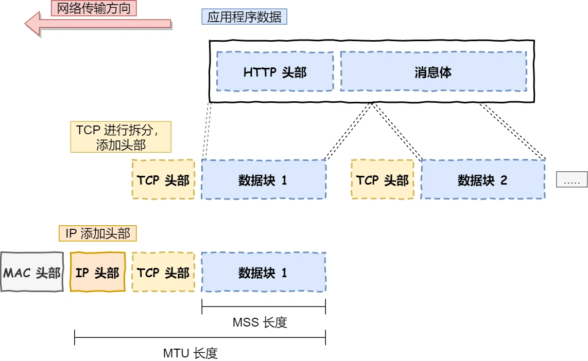

# 17 Nov - Fri

Today's stuff

<table data-header-hidden><thead><tr><th width="80" data-type="checkbox"></th><th width="120" data-type="select" data-multiple>Type</th><th>Action</th></tr></thead><tbody><tr><td>false</td><td></td><td>leetcode</td></tr><tr><td>false</td><td></td><td>6.824 CR&#x26;CRAQ</td></tr><tr><td>false</td><td></td><td>0x3f tea</td></tr><tr><td>false</td><td></td><td>algorithm</td></tr><tr><td>false</td><td></td><td>日本語のstudy</td></tr><tr><td>false</td><td></td><td>xiaolin coding</td></tr></tbody></table>

## Notes & ideas


zookeeper


<details>

<summary>leetcode</summary>

1\. (打卡)[ 1032 \[字符流\]](https://leetcode.cn/problems/stream-of-characters/description/) 🤩

.png>)

根据words构建前缀树，包含两个属性

children指向子节点 isend是否为字符串结尾

insert和query就是很经典的trie函数了


```cpp
class Trie {
public:
    vector<Trie*> children;
    bool isEnd;

    Trie()
        : children(26)
        , isEnd(false) {}

    void insert(string& w) {
        Trie* node = this;
        reverse(w.begin(), w.end());
        for (char& c : w) {
            int idx = c - 'a';
            if (!node->children[idx]) {
                node->children[idx] = new Trie();
            }
            node = node->children[idx];
        }
        node->isEnd = true;
    }

    bool search(string& w) {
        Trie* node = this;
        for (int i = w.size() - 1, j = 0; ~i && j < 201; --i, ++j) {
            int idx = w[i] - 'a';
            if (!node->children[idx]) {
                return false;
            }
            node = node->children[idx];
            if (node->isEnd) {
                return true;
            }
        }
        return false;
    }
};

class StreamChecker {
public:
    Trie* trie = new Trie();
    string s;

    StreamChecker(vector<string>& words) {
        for (auto& w : words) {
            trie->insert(w);
        }
    }

    bool query(char letter) {
        s += letter;
        return trie->search(s);
    }
};

/**
 * Your StreamChecker object will be instantiated and called as such:
 * StreamChecker* obj = new StreamChecker(words);
 * bool param_1 = obj->query(letter);
 */
```


\
2\. (复习) [187 \[重复的DNA序列\]](https://leetcode.cn/problems/repeated-dna-sequences/description/) OQK0RBF$]V03L.png)

.png>)

不多说 就用个哈希表存一下就好了 中等题也参差不齐。


```cpp
class Solution {
public:
    vector<string> findRepeatedDnaSequences(string s) {
        unordered_map<string, int> cnt;
        vector<string> ans;
        for(int i=0;i<s.length();i++){
            string sub = s.substr(i,10);
            if(++cnt[sub]==2)
                ans.push_back(sub);
        }        
        return ans;
    }
};
```


\
3\. (每日) [2736 \[最大和查询\]](https://leetcode.cn/problems/maximum-sum-queries/description/?envType=daily-question\&envId=2023-11-17) 🤩

.png>)

有点昏 看题解也懵逼 抄个题解先

```cpp
class Solution {
public:
    vector<int> maximumSumQueries(vector<int>& nums1, vector<int>& nums2, vector<vector<int>>& queries) {
        vector<pair<int, int>> sortedNums;
        vector<tuple<int, int, int>> sortedQueries;
        for (int i = 0; i < nums1.size(); i++) {
            sortedNums.emplace_back(nums1[i], nums2[i]);
        }
        sort(sortedNums.begin(), sortedNums.end(), greater<pair<int, int>>());
        for (int i = 0; i < queries.size(); i++) {
            sortedQueries.emplace_back(i, queries[i][0], queries[i][1]);
        }
        sort(sortedQueries.begin(), sortedQueries.end(), [](tuple<int, int, int> &a, tuple<int, int, int> &b) {
            return get<1>(a) > get<1>(b);
        });

        vector<pair<int, int>> stk;
        vector<int> answer(queries.size(), -1);
        int j = 0;
        for (auto &[i, x, y] : sortedQueries) {
            while (j < sortedNums.size() && sortedNums[j].first >= x) {
                auto [num1, num2] = sortedNums[j];
                while (!stk.empty() && stk.back().second <= num1 + num2) {
                    stk.pop_back();
                }
                if (stk.empty() || stk.back().first < num2) {
                    stk.emplace_back(num2, num1 + num2);
                }
                j++;
            }
            int k = lower_bound(stk.begin(), stk.end(), make_pair(y, 0)) - stk.begin();
            if (k < stk.size()) {
                answer[i] = stk[k].second;
            }
        }            
        return answer;
    }
};
```

</details>

<details>

<summary><a href="https://codeforces.com/problemset/problem/1665/E">tea</a></summary>

```
https://codeforces.com/problemset/problem/1665/E

输入 T(≤1e4) 表示 T 组数据。所有数据的 n 之和 ≤1e5，q 之和 ≤1e5。
每组数据输入 n(1≤n≤1e5) 和长为 n 的数组 a(0≤a[i]<2^30)。数组下标从 1 开始。
然后输入 q(1≤q≤1e5) 和 q 个询问，每个询问输入两个数 L 和 R，表示下标从 L 到 R 的连续子数组 (1≤L<R≤n)。
对于每个询问，输出子数组内两个下标不同的数的 OR 的最小值。
```

example:

.png>)

```markdown
从特殊到一般。

一
如果 
a 中只有 0 和 1，我们只需要知道区间内是否有两个0。

如果有两个 0，那么最小 OR 是0，否则是1。

相当于只需要知道最小的两个数是多少，就能确定 OR 最小是多少。

二
如果 a 中只有 0,1,2,3，在最坏情况下，最少需要知道几个数呢？

考虑下面这三个二进制数，其中? 表示 0 或者 1。

0?
1?
1?
​
 
如果只选择 
0? 和 1?，这在 00 和 10的情况下是没问题的，但当它们分别是


01
10
10
​
 
只选择 
01 和 10 会算出 OR 为 11，但是选择 10 和 10 会算出 OR 为 10。

猜想：在 a 中只有 0,1,2,3 的情况下，至少要知道最小的 3 个数，才能保证一定可以得到 OR 的最小值。

证明：分类讨论。

如果有两个 0?，那么 OR 的最高位肯定是 0，问题变成一个比特，也就是 a 中只有 0 和 1 的情况。我们已经知道，这只需要知道最小的2 个数。
如果没有 0? 只有 1?，那么 OR 的最高位肯定是 1，所以同上，变成一个比特的问题，也只需要知道最小的 2 个数。
如果恰好有一个 0?，其余的是1?，继续分类讨论：
如果 0? 和 1? 的 OR 最小，那么 1? 这边只需要选最小的数。
如果 1? 和 1? 的 OR 最小，问题变成上面讨论的第 2 点，需要知道1? 中最小的 2 个数。
所以知道最小的 3 个数就行，OR 的最小值一定是这 3 个数中的 2 个数的 OR。
三
如果 
a[i] 的范围是 [0,7]，至少要知道最小的几个数，才能保证一定可以得到 OR 的最小值？

至少要知道最小的 4 个数，证明方式同上。

按照如下方式构造，可以使 OR 的最小值一定来自第三小和第四小的数的 OR。

011
101
110
110
​
 
如果 a[i] 的范围是 [0,15]，构造方法如下：

0111
1011
1101
1110
1110
​
 
四
总的来说，通过数学归纳法可以证明，OR 的最小值一定是最小的 31 个数中选 2 个数的 OR。

所以用线段树维护区间内最小的 31 个数，问题就变成 C(31,2) 的暴力枚举了。
```

😢周五的茶实在喝不动 先抄为敬


```go
package main

import (
	"bufio"
	. "fmt"
	"os"
)

func min(a, b int) int {
	if b < a {
		return b
	}
	return a
}

type seg [][]int

// 合并两个有序数组，保留前 k 个数
func merge(a, b []int) []int {
	const k = 31
	i, n := 0, len(a)
	j, m := 0, len(b)
	res := make([]int, 0, min(n+m, k))
	for len(res) < k {
		if i == n {
			res = append(res, b[j:min(j+k-len(res), m)]...)
			break
		}
		if j == m {
			res = append(res, a[i:min(i+k-len(res), n)]...)
			break
		}
		if a[i] < b[j] {
			res = append(res, a[i])
			i++
		} else {
			res = append(res, b[j])
			j++
		}
	}
	return res
}
func (t seg) build(a []int, o, l, r int) {
	if l == r {
		t[o] = a[l-1 : l]
		return
	}
	m := (l + r) >> 1
	t.build(a, o<<1, l, m)
	t.build(a, o<<1|1, m+1, r)
	t[o] = merge(t[o<<1], t[o<<1|1])
}

func (t seg) query(o, l, r, L, R int) []int {
	if L <= l && r <= R {
		return t[o]
	}
	m := (l + r) >> 1
	if R <= m {
		return t.query(o<<1, l, m, L, R)
	}
	if m < L {
		return t.query(o<<1|1, m+1, r, L, R)
	}
	return merge(t.query(o<<1, l, m, L, R), t.query(o<<1|1, m+1, r, L, R))
}
func main() {
	in := bufio.NewReader(os.Stdin)
	out := bufio.NewWriter(os.Stdout)
	defer out.Flush()

	var T, n, q, l, r int
	for Fscan(in, &T); T > 0; T-- {
		Fscan(in, &n)
		a := make([]int, n)
		for i := range a {
			Fscan(in, &a[i])
		}
		t := make(seg, n*4)
		t.build(a, 1, 1, n)
		for Fscan(in, &q); q > 0; q-- {
			Fscan(in, &l, &r)
			b := t.query(1, 1, n, l, r)
			ans := 1 << 30
			for i, v := range b {
				for _, w := range b[:i] {
					ans = min(ans, v|w)
				}
			}
			Fprintln(out, ans)
		}
	}
}

```


</details>

<details>

<summary>6.824 chain replication</summary>

呃 明明是cr 今天却看了个craq Apportioned Queries 就是更牛逼一点？还不知道怎么实现的 再看看

</details>

<details>

<summary>algorithm</summary>

今日算法 trie树

也就是字典树 这棵字典树用边来代表字母，而从根结点到树上某一结点的路径就代表了一个字符串。举个例子，1->4->8->13表示的就是字符串 `caa`。

有时需要标记插入进 trie 的是哪些字符串，每次插入完成时在这个字符串所代表的节点处打上标记即可。



```cpp
//模板
struct trie {
  int nex[100000][26], cnt;
  bool exist[100000];  // 该结点结尾的字符串是否存在

  void insert(char *s, int l) {  // 插入字符串
    int p = 0;
    for (int i = 0; i < l; i++) {
      int c = s[i] - 'a';
      if (!nex[p][c]) nex[p][c] = ++cnt;  // 如果没有，就添加结点
      p = nex[p][c];
    }
    exist[p] = 1;
  }

  bool find(char *s, int l) {  // 查找字符串
    int p = 0;
    for (int i = 0; i < l; i++) {
      int c = s[i] - 'a';
      if (!nex[p][c]) return 0;
      p = nex[p][c];
    }
    return exist[p];
  }
};
```


应用太多了。。。最常见的就是检查一个字符串有没有出现过 其他的高级用法估计不太用的上 以后再补叭

</details>

<details>

<summary>xiaolin coding</summary>

呃 其实看过一遍了 但是忘得有点快 就从新开始再过一遍

TCP/IP层次模型

```
应用层

应用层只需要专注于为用户提供应用功能，比如 HTTP、FTP、Telnet、DNS、SMTP等。
```

```
传输层

两个传输协议：TCP和UDP
TCP 的全称叫传输控制协议（Transmission Control Protocol），大部分应用使用的正是 TCP 传输层协议
，比如 HTTP 应用层协议。TCP 相比 UDP 多了很多特性，比如流量控制、超时重传、拥塞控制等，这些都
是为了保证数据包能可靠地传输给对方。

UDP 相对来说就很简单，简单到只负责发送数据包，不保证数据包是否能抵达对方，但它实时性相对更好，
传输效率也高。当然，UDP 也可以实现可靠传输，把 TCP 的特性在应用层上实现就可以，不过要实现一个
商用的可靠 UDP 传输协议，也不是一件简单的事情。

应用需要传输的数据可能会非常大，如果直接传输就不好控制，因此当传输层的数据包大小超过 MSS（TC
P 最大报文段长度） ，就要将数据包分块，这样即使中途有一个分块丢失或损坏了，只需要重新发送这一
个分块，而不用重新发送整个数据包。在 TCP 协议中，我们把每个分块称为一个 TCP 段（TCP Segment）。
```

.png>)

```
网络层
网络层最常使用的是 IP 协议（Internet Protocol），IP 协议会将传输层的报文作为数据部分，再加上 
IP 包头组装成 IP 报文，如果 IP 报文大小超过 MTU（以太网中一般为 1500 字节）就会再次进行分片
，得到一个即将发送到网络的 IP 报文。
```

 (1).png>)

```
网络接口层
生成了 IP 头部之后，接下来要交给网络接口层（Link Layer）在 IP 头部的前面加上 MAC 头部，并
封装成数据帧（Data frame）发送到网络上。
网络接口层主要为网络层提供「链路级别」传输的服务，负责在以太网、WiFi 这样的底层网络上发
送原始数据包，工作在网卡这个层次，使用 MAC 地址来标识网络上的设备。
```


</details>

<details>

<summary>日本語のstudy</summary>

希望有时间能学。。每天抽出个十几二十分钟试试

</details>

## How was the day?

<details>

<summary>🧠 Mood tracking</summary>

昏头了哥们 2185出列 不知道在干嘛 多睡觉！

</details>

<details>

<summary>💡 Observations</summary>

Brain is a little rusty.... and too lazy

</details>


**GitBook tip:** Use the **rating** column in a table to build a super simple habit-tracking section.


<table data-header-hidden><thead><tr><th width="120" data-type="rating" data-max="5"></th><th>Task</th></tr></thead><tbody><tr><td>2</td><td>Sleep</td></tr><tr><td>3</td><td>Work/life balance</td></tr><tr><td>3</td><td>Creativity</td></tr><tr><td>3</td><td>Fitness</td></tr></tbody></table>
